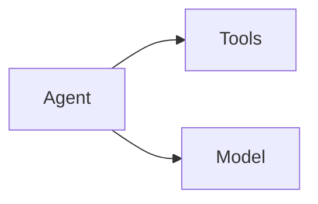
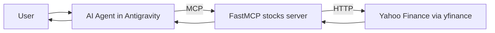
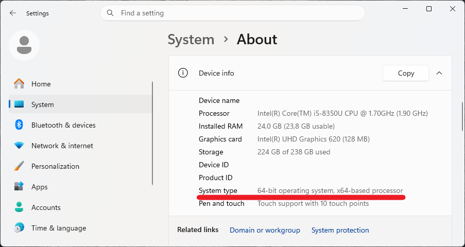
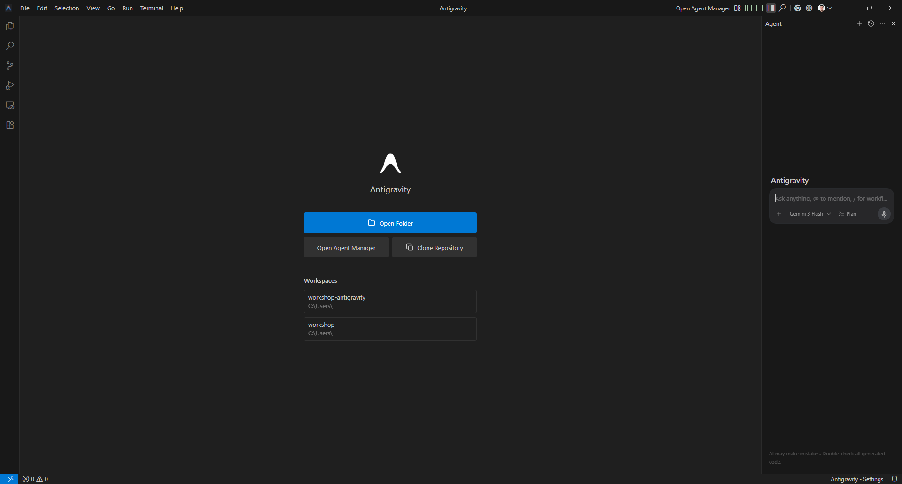
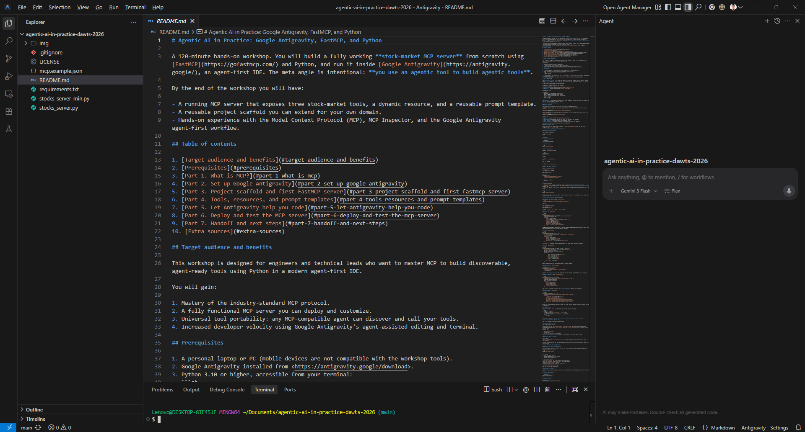
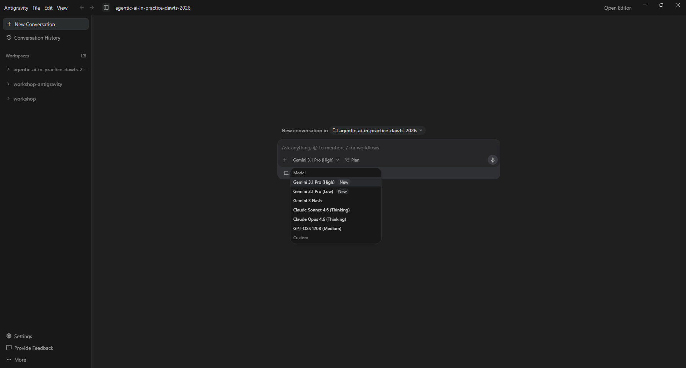
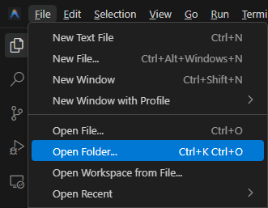

# Agentic AI in Practice: Google Antigravity, FastMCP, and Python

A 120-minute hands-on workshop. You will build a fully working **stock-market MCP server** from scratch using [FastMCP](https://gofastmcp.com/) and Python, and run it inside [Google Antigravity](https://antigravity.google/), an agent-first IDE. The meta angle is intentional: **you use an agentic tool to build agentic tools**.

By the end of the workshop you will have:

- A running MCP server that exposes three stock-market tools, a dynamic resource, and a reusable prompt template.
- A reusable project scaffold you can extend for your own domain.
- Hands-on experience with the Model Context Protocol (MCP), MCP Inspector, and the Google Antigravity agent-first workflow.

## Table of contents

1. [Target audience and benefits](#target-audience-and-benefits)
2. [Prerequisites](#prerequisites)
3. [Part 1. What is MCP?](#part-1-what-is-mcp)
4. [Part 2. Set up Google Antigravity](#part-2-set-up-google-antigravity)
5. [Part 3. Project scaffold and first FastMCP server](#part-3-project-scaffold-and-first-fastmcp-server)
6. [Part 4. Tools, resources, and prompt templates](#part-4-tools-resources-and-prompt-templates)
7. [Part 5. Let Antigravity help you code](#part-5-let-antigravity-help-you-code)
8. [Part 6. Deploy and test the MCP server](#part-6-deploy-and-test-the-mcp-server)
9. [Part 7. Handoff and next steps](#part-7-handoff-and-next-steps)
10. [Extra sources](#extra-sources)

## Target audience and benefits

This workshop is designed for engineers and technical leads who want to master MCP to build discoverable, agent-ready tools using Python in a modern agent-first IDE.

You will gain:

1. Mastery of the industry-standard MCP protocol.
2. A fully functional MCP server you can deploy and customize.
3. Universal tool portability: any MCP-compatible agent can discover and call your tools.
4. Increased developer velocity using Google Antigravity's agent-assisted editing and terminal.

## Prerequisites

1. A personal laptop or PC (mobile devices are not compatible with the workshop tools).
2. Google Antigravity installed from <https://antigravity.google/download>.
3. Python 3.10 or higher, accessible from your terminal:
   ```sh
   $ python --version
   ```
4. A package manager. This workshop uses `pip`. If you prefer [`uv`](https://docs.astral.sh/uv/), the equivalent commands are shown inline.
5. A personal Google account for signing in to [Google Antigravity](https://antigravity.google/).

## Part 1. What is MCP?
An AI agent is a system that uses a **model** to reason about and select the appropriate **tools** to achieve a specific goal.



The **Model Context Protocol (MCP)** is an open standard for connecting AI agents to tools and data. An agent speaks to any MCP-compatible server through the same protocol, the same way a browser speaks HTTP to any web server.

An MCP server can expose three kinds of capabilities:

| Capability | Purpose | Example in this workshop |
| --- | --- | --- |
| **Tool** | An action the agent can call | `get_stock_price("AAPL")` |
| **Resource** | Read-only context the agent can load | `stocks://watchlist` |
| **Prompt** | A reusable prompt template | `analyze_stock("AAPL")` |

The high-level flow:



**Why it matters.** Without MCP, every agent needs a custom integration for every tool. With MCP, you build the tool once and every compatible agent can use it.

## Part 2. Set up Google Antigravity

### Install Antigravity

Download and install Google Antigravity from <https://antigravity.google/download>.

For Windows operating system, you can check your system type (`x64` vs `ARM64`) in the `Settings > System > About`:



Launch the Google Antigravity desktop application and sign in with your personal Google account (e.g., `name.surname@gmail.com`).



### Quick tour

Antigravity is an agent-first IDE. The parts you will use today:

- **Editor Agent** — a chat panel that can read, write, and run code in your workspace.
- **Agent Manager** — orchestrates longer, multi-step agent tasks.
- **Built-in terminal** — the agent can execute shell commands here (with your approval).




**Note:** [Git Bash for Windows](https://git-scm.com/install/windows).

### Open the workshop folder

Create a new folder for the workshop (for example `C:\Users\<you>\Documents\workshop`) and open it in Antigravity via `File > Open Folder…`.



## Part 3. Project scaffold and first FastMCP server

### Create a virtual environment

From the built-in terminal:

```sh
python -m venv .venv
```

Activate it.

On **Windows (PowerShell)**:

```powershell
.venv\Scripts\Activate.ps1
```

On **macOS / Linux**:

```sh
source .venv/bin/activate
```

### Declare dependencies

Create a `requirements.txt` file:

```text
fastmcp>=3.2.4
yfinance>=1.3.0
```

Install:

```sh
pip install -r requirements.txt
```

With `uv` instead:

```sh
uv pip install -r requirements.txt
```

### Write the minimal MCP server

Create `stocks_server_min.py`:

```python
from fastmcp import FastMCP

mcp = FastMCP("stocks")


@mcp.tool
def ping() -> str:
    """Return a simple health-check message."""
    return "stocks MCP server is alive"


if __name__ == "__main__":
    mcp.run()
```

Three things to notice:

1. `FastMCP("stocks")` creates a server named `stocks`. Agents will discover tools under this name.
2. `@mcp.tool` turns any Python function into an MCP tool. The **docstring becomes the tool description** that the agent sees.
3. `mcp.run()` defaults to the **stdio** transport, which is how local MCP clients like Antigravity talk to the server.

### Run the server

```sh
python stocks_server_min.py
```

The server runs silently on stdio, waiting for an MCP client. Press `Ctrl+C` to stop it. You will connect it to a real client in Part 6.

## Part 4. Tools, resources, and prompt templates

Now create the full server. Create `stocks_server.py`:

```python
"""Stock market MCP server built with FastMCP and yfinance."""

import os

import yfinance as yf
from fastmcp import FastMCP

mcp = FastMCP("stocks")

WATCHLIST = ["AAPL", "MSFT", "GOOGL", "NVDA", "TSLA"]
```

### Tool 1: `get_company_info`

```python
@mcp.tool
def get_company_info(ticker: str) -> dict:
    """Return basic company information for the given ticker symbol."""
    info = yf.Ticker(ticker).info
    return {
        "ticker": ticker.upper(),
        "name": info.get("longName") or info.get("shortName"),
        "sector": info.get("sector"),
        "industry": info.get("industry"),
        "country": info.get("country"),
        "website": info.get("website"),
        "market_cap": info.get("marketCap"),
        "summary": info.get("longBusinessSummary"),
    }
```

FastMCP reads the type hints and docstring to generate the tool's JSON schema automatically. Keep return values JSON-serializable (dicts, lists, strings, numbers, booleans).

### Tool 2: `get_stock_price`

```python
@mcp.tool
def get_stock_price(ticker: str) -> dict:
    """Return the latest available stock price and currency for the ticker."""
    t = yf.Ticker(ticker)
    fast = t.fast_info
    return {
        "ticker": ticker.upper(),
        "price": float(fast["last_price"]),
        "currency": fast.get("currency"),
        "previous_close": float(fast.get("previous_close")),
    }
```

`fast_info` is a lightweight yfinance endpoint that is fast enough for an interactive agent call.

### Tool 3: `get_stock_history`

```python
@mcp.tool
def get_stock_history(ticker: str, days: int = 7) -> list[dict]:
    """Return daily OHLCV history for the last N days (default 7)."""
    period = f"{max(1, int(days))}d"
    df = yf.Ticker(ticker).history(period=period)
    df = df.reset_index()
    return [
        {
            "date": row["Date"].strftime("%Y-%m-%d"),
            "open": float(row["Open"]),
            "high": float(row["High"]),
            "low": float(row["Low"]),
            "close": float(row["Close"]),
            "volume": int(row["Volume"]),
        }
        for _, row in df.iterrows()
    ]
```

Default parameter values are exposed to the agent as optional arguments.

### Static resource: `stocks://watchlist`

```python
@mcp.resource("stocks://watchlist")
def watchlist() -> list[str]:
    """Return the default watchlist of ticker symbols."""
    return WATCHLIST
```

Resources are **read-only context**: the agent loads them when it needs background data, not as an action.

### Resource template: `stocks://{ticker}/summary`

```python
@mcp.resource("stocks://{ticker}/summary")
def ticker_summary(ticker: str) -> dict:
    """Return a short summary (name, sector, latest price) for a ticker."""
    info = get_company_info(ticker)
    price = get_stock_price(ticker)
    return {
        "ticker": ticker.upper(),
        "name": info["name"],
        "sector": info["sector"],
        "price": price["price"],
        "currency": price["currency"],
    }
```

The `{ticker}` placeholder turns this into a **resource template** the agent can parameterize.

### Prompt template: `analyze_stock`

```python
@mcp.prompt
def analyze_stock(ticker: str) -> str:
    """Reusable prompt template that asks the agent to analyze a stock."""
    return (
        f"Analyze the stock {ticker.upper()}.\n\n"
        "Use the MCP tools to gather:\n"
        "1. Company information (get_company_info)\n"
        "2. Current price (get_stock_price)\n"
        "3. 30-day price history (get_stock_history with days=30)\n\n"
        "Then write a concise report covering: business overview, recent "
        "price trend, and one risk and one opportunity for an investor."
    )
```

Prompts are reusable templates the user (or agent) can invoke. They are ideal for multi-tool workflows you want to standardize.

### Transport switch

End the file with a `__main__` block that lets you pick the transport at runtime:

```python
if __name__ == "__main__":
    transport = os.getenv("MCP_TRANSPORT", "stdio").lower()
    if transport == "http":
        mcp.run(transport="http", host="127.0.0.1", port=8000)
    else:
        mcp.run()
```

You now have a complete MCP server: **3 tools, 1 static resource, 1 resource template, 1 prompt**.

## Part 5. Let Antigravity help you code

Time to use the agent-first features of Antigravity.

### Exercise: add a fourth tool

Open the Editor Agent and ask:

> Add a fourth MCP tool `get_dividends(ticker)` to `stocks_server.py` that returns the last 12 months of dividend payments as a list of `{date, amount}` dicts. Use `yf.Ticker(ticker).dividends`. Follow the style of the other tools.

The agent will:

1. Read `stocks_server.py`.
2. Propose a diff.
3. Wait for your approval before applying it.

**Review the diff before accepting.** The agent is fast, but you are still the author of record.

### Exercise: improve a docstring

Ask the agent:

> Rewrite the docstring of `get_stock_history` so an AI agent understands exactly when to call it versus `get_stock_price`.

A clearer docstring improves tool discovery because MCP clients send docstrings to the underlying LLM as part of the tool schema.

## Part 6. Deploy and test the MCP server

### Option A. Local stdio with MCP Inspector

The fastest way to inspect the server is with the [MCP Inspector](https://github.com/modelcontextprotocol/inspector) shipped with FastMCP:

```sh
fastmcp dev stocks_server.py
```

This command:

1. Starts your server on stdio.
2. Launches MCP Inspector in your browser.
3. Connects the two automatically.

In the Inspector you can:

- List tools, resources, and prompts that your server advertises.
- Call `get_stock_price` with `ticker="AAPL"` and see the response.
- Read the `stocks://watchlist` resource.
- Render the `analyze_stock` prompt with `ticker="MSFT"`.

*(screenshot: MCP Inspector tools tab)*

Stop with `Ctrl+C` when you are done.

### Option B. HTTP transport

To expose the server over the network (still local for the workshop), set the transport env var and run the same file:

On **Windows (PowerShell)**:

```powershell
$env:MCP_TRANSPORT = "http"
python stocks_server.py
```

On **macOS / Linux**:

```sh
MCP_TRANSPORT=http python stocks_server.py
```

The server now listens on `http://127.0.0.1:8000/mcp/`.

To inspect the HTTP endpoint, start the Inspector on its own and point it at the URL:

```sh
npx @modelcontextprotocol/inspector
```

In the Inspector UI:

1. Set **Transport Type** to `Streamable HTTP`.
2. Set **URL** to `http://127.0.0.1:8000/mcp/`.
3. Click **Connect**.

You should see the same tools, resources, and prompt as in Option A.

### Option C. Connect the server to Google Antigravity

Antigravity reads an `mcp.json`-style configuration to register MCP servers. Create `mcp.example.json` in the workshop folder:

```json
{
  "mcpServers": {
    "stocks": {
      "command": "python",
      "args": ["C:/Users/Lenovo/Documents/workshop/stocks_server.py"],
      "env": {
        "MCP_TRANSPORT": "stdio"
      }
    }
  }
}
```

Adjust the path in `args` to match your own workshop folder. In Antigravity, open the MCP settings (`Settings` > `MCP Servers` > `Add`) and paste the `stocks` block.

*(screenshot: Antigravity MCP settings with the stocks server registered)*

Then, in the Editor Agent chat, ask a natural-language question:

> What is the current price of Apple stock, and how did it move over the last 5 trading days?

Antigravity will:

1. Discover your MCP server.
2. Call `get_stock_price("AAPL")` and `get_stock_history("AAPL", days=5)`.
3. Summarize the result.

You have now built, deployed, and used a real MCP server.

## Part 7. Handoff and next steps

Ideas to extend the server after the workshop:

- **Caching.** Wrap `yfinance` calls in a small TTL cache (for example `functools.lru_cache` plus a timestamp) to avoid rate limits.
- **More tools.** `get_dividends`, `get_earnings_dates`, `search_ticker`.
- **Authentication.** FastMCP supports bearer-token auth for HTTP transport; useful when you expose the server outside `localhost`.
- **Packaging.** Turn the file into a PyPI package so others can `pip install` and `mcp run your-package`.
- **Typed outputs.** Replace `dict` return types with `pydantic.BaseModel` or `TypedDict` for richer schemas.

### Practical tips

- **Keep tool names verb-shaped.** `get_stock_price` beats `stock_price_tool`.
- **Write docstrings for the agent, not for yourself.** State *when* to call the tool and *what* it returns.
- **Return small, structured JSON.** Agents handle dicts and short lists better than long free-form strings.
- **Never block on user input inside a tool.** Tools must return quickly and deterministically.

## Extra sources

1. [FastMCP documentation](https://gofastmcp.com/)
2. [Model Context Protocol specification](https://modelcontextprotocol.io/)
3. [MCP Inspector on GitHub](https://github.com/modelcontextprotocol/inspector)
4. [yfinance on GitHub](https://github.com/ranaroussi/yfinance)
5. [Google Antigravity](https://antigravity.google/)
